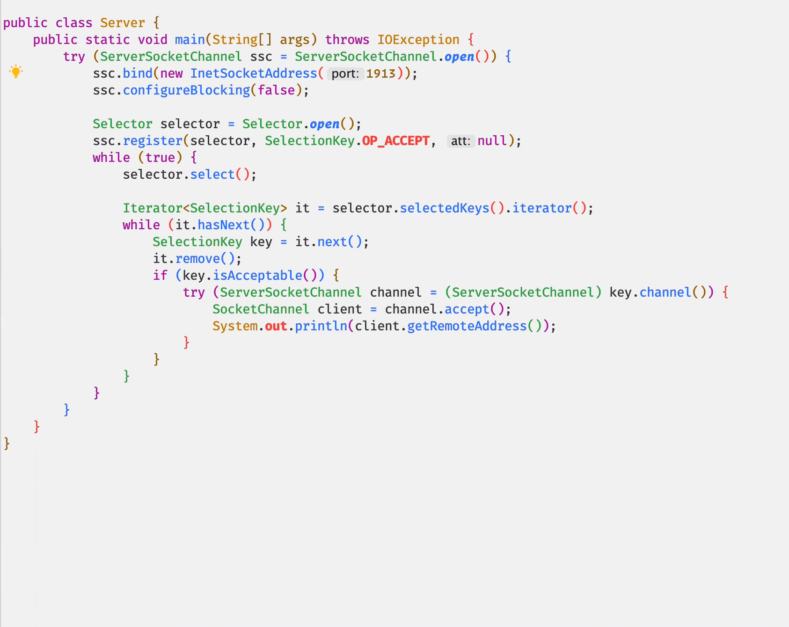
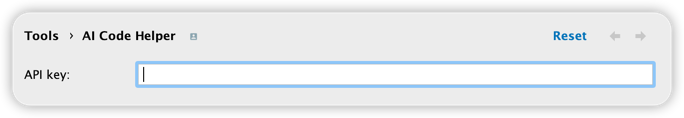
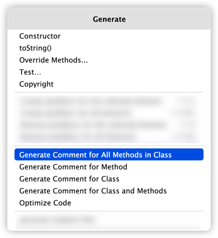

# AI Code Helper

This plugin allows you to **generate and analyze code using ChatGPT**.

## Feature

- [x] Generate comment for method
- [x] Generate comment for all methods in class
- [x] Generate comment for Class
- [x] Generate comment for Class and Methods
- [x] Optimize code

## Usage

First of all, you must fill your `API Key`.  
`Setting` > `Tools` > `Ai Code Helper` > `API key`

Then you can use following actions.

1. `Generate` > `Generate Comment for Method`
2. `Generate` > `Generate Comment for All Methods in Class`
3. `Generate` > `Generate Comment for Class`
4. `Generate` > `Generate Comment for Class and Methods`
5. `Generate` > `Optimize Code`

Happy coding! 🎉